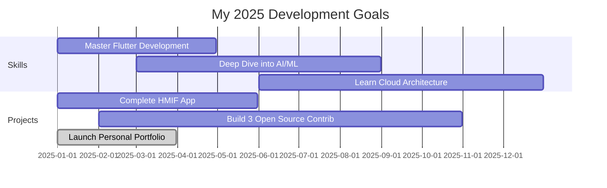

## 🚀 About Me

🎓 **Computer Science Student** at Kalimantan Institute of Technology  
💻 **Passionate Developer** exploring fullstack development & emerging technologies  
🌱 **Lifelong Learner** always curious about new tech trends  
🎯 **Goal-Oriented** with a focus on building impactful solutions  

### 💭 My Philosophy
> *"Code is like humor. When you have to explain it, it's bad."* – Cory House  
> 
> I believe in writing clean, efficient code that speaks for itself!

---

## 🔥 What I'm Up To

<table>
<tr>
<td width="50%">

### 🛠️ Current Projects
- 🚀 **HMIF App** — Community platform for Informatics students
- 🏪 **POS Backend System** — Scalable backend with Node.js + PostgreSQL
- 🏠 **Smart Home Simulation** — IoT project with JavaFX & sensors
- 📱 **Personal Portfolio** — Showcasing my development journey

</td>
<td width="50%">

### 📖 Learning Journey
- 📱 **Flutter & Dart** — Cross-platform mobile development
- 🤖 **AI/ML** — TensorFlow, Scikit-learn, PyTorch
- ☁️ **DevOps** — Docker, CI/CD, AWS/GCP
- 🎨 **UI/UX Design** — Figma, Design Systems

</td>
</tr>
</table>

---

## 🎯 2025 Roadmap

---

## 🌟 Featured Projects

| 🚀 Project | 📝 Description | 🛠️ Tech Stack | 🔗 Links |
|:----------:|:----------------|:---------------|:--------:|
| **HMIF App** | Mobile platform connecting ITK Informatics community with events, resources, and networking |    | [🔗 View](#) |
| **Smart Home IoT** | JavaFX-based home automation simulation with real sensor integration |    | [🔗 View](#) |
| **TandaiHoax** | Health information verification platform using trusted medical sources |    | [🔗 View](#) |

---

## 🛠️ Tech Arsenal

### Languages & Frameworks

### Development Tools

### Databases & Cloud

### Design & Hardware

---

## 📊 GitHub Analytics

## 🏆 GitHub Trophies

---

## 🤝 Let's Connect!

### 💌 Open for Collaboration!
*Interested in working together? Have a cool project idea? Let's chat!*

---

*"The best way to predict the future is to invent it."* – Alan Kay

**Thanks for visiting my profile! ⭐ Star some repos if you find them interesting!**

<!-- Proudly crafted with passion by Noel Ericson Rapael Sipayung -->